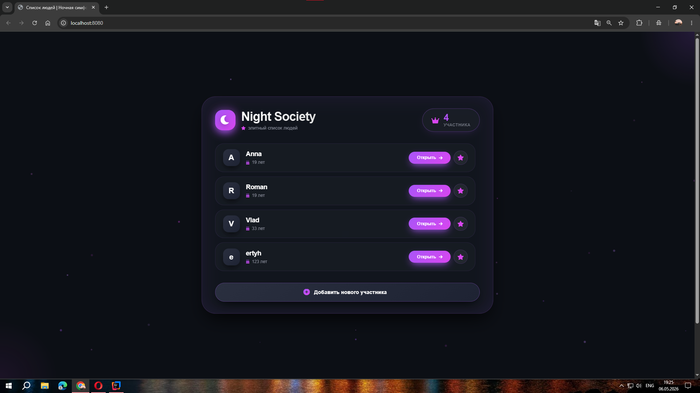
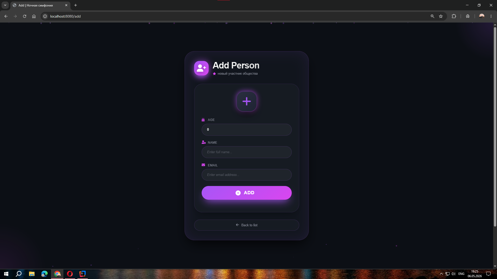
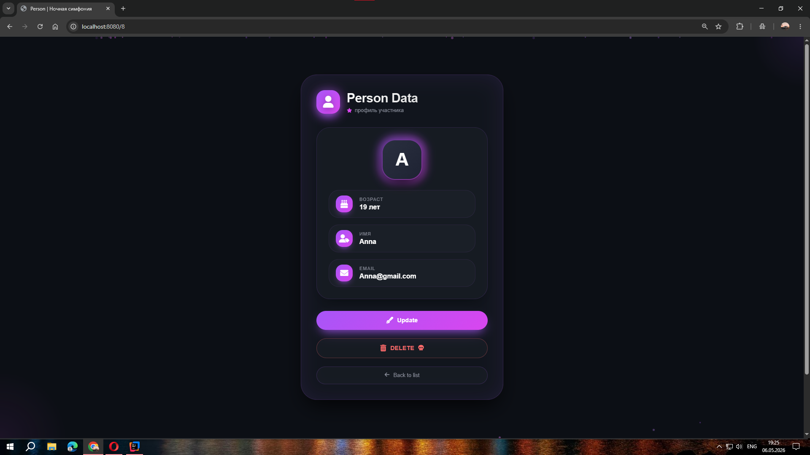
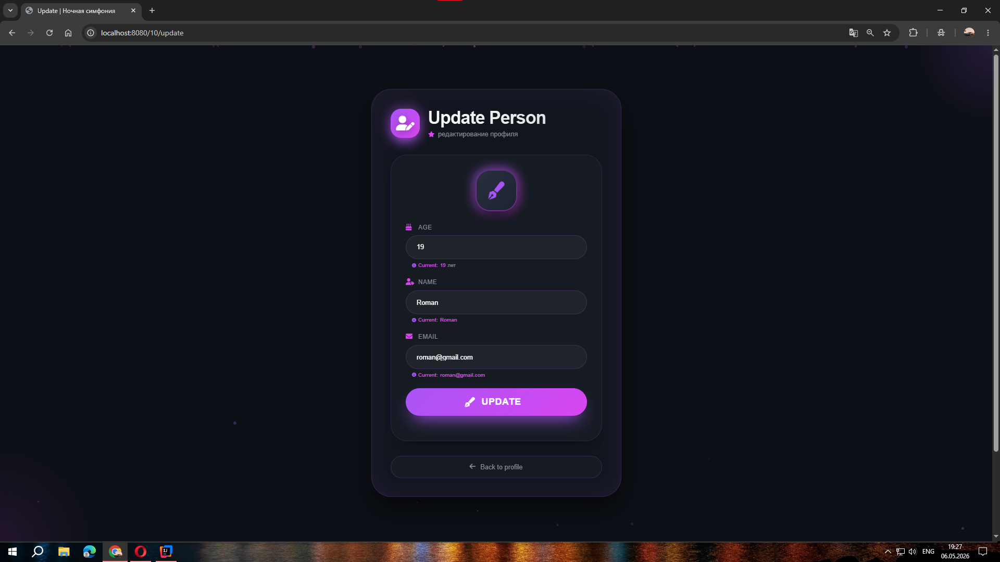

# PersonCRUD — Учебное приложение на Spring Boot

**Учебный проект** Веб-приложение для выполнения базовых (CRUD) операций над сущностью `Person`.

Проект создан для отработки навыков интеграции Spring Boot с веб-интерфейсом, работы с базой данных через Hibernate и настройки простого фронтенда.
---

## Возможности:

- **Создание** новой записи о человеке
- **Просмотр** списка всех записей
- **Редактирование** существующей записи
- **Удаление** записи из базы данных
- Валидация вводимых данных (например, обязательные поля)

---

## Технологии:

- java 17
- Spring Boot
- Spring Web
- Spring Data Jpa
- Hibernate
- JDBC
- PostgreSQL
- Thymeleaf

---

## Скриншоты:

> 
> 
> 
> 

---

## Как запустить

### 1. Клонировать репозиторий:

```bash
    git clone https://github.com/Roman-Dorosh/PersonCRUD.git
```

### 2. Настроить и запустить PostgreSQL:

- Убедитесь, что PostgreSQL установлен и запущен. Затем создайте базу данных:

> CREATE DATABASE PersonCRUD;

### 3. Выполнить SQL код, который лежит в папке:

> IDEA Project\PersonCRUD\src\main\resources\sql

### 4. Настроить подключение к БД:

- В файле src/main/resources/application.properties укажите свои данные:

    - spring.datasource.url=jdbc:postgresql://localhost:5432/PersonCRUD
    - spring.datasource.username=postgres
    - spring.datasource.password=ваш_пароль

> Если не хотите писать SQl раскомментируйте строчку #spring.jpa.hibernate.ddl-auto=update - она создаст необходимый SQL
> при запуске проекта

### 5. Запуск приложения

- Перейдите в класс PersonCrudApplication и запустите метод main после этого проект запустится и вам нужно будет перейти
  по адресу: http://localhost:8080

---

### 🎌 Автор 🎌

Roman Dorosh — GitHub https://github.com/Roman-Dorosh